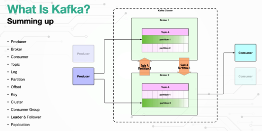
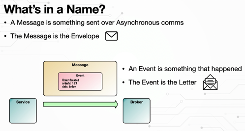
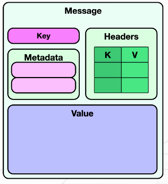
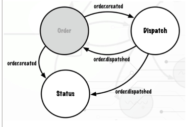
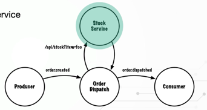
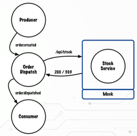

# Introduction to Kafka with Spring Boot

This repository contains the code to support the [Introduction to Kafka with Spring Boot](https://www.udemy.com/course/introduction-to-kafka-with-spring-boot/?referralCode=15118530CA63AD1AF16D) online course.

The application code is for a message driven service which utilises Kafka and Spring Boot 3.

The code in this repository is used to help students learn how to produce and consume messages in Java using Spring Kafka and Spring Boot 3.
The course provides step by step instructions and detailed explanations for students to build up the code themselves.
This repository provides the code to support the course broken down section by section using branches, allowing students to
compare and contrast the code they create with the lesson code in the branches.

As you work through the course, please feel free to fork this repository to your own GitHub repo. Most lectures contain links
to source code changes. If you encounter a problem you can compare your code to the lecture code. See the [How to Compare Branches](https://github.com/lydtechconsulting/introduction-to-kafka-with-spring-boot/wiki#how-to-compare-branches) section in the Wiki.

## Introduction to Kafka with Spring Boot Course Wiki
Plenty of useful information about your Introduction to Kafka with Spring Boot course can be found in the [Wiki](https://github.com/lydtechconsulting/introduction-to-kafka-with-spring-boot/wiki).

## Getting Your Development Environment Setup
### Recommended Versions
| Recommended                | Reference                                                             | Notes                                                                                                                                                                                                                                                          |
|----------------------------|-----------------------------------------------------------------------|----------------------------------------------------------------------------------------------------------------------------------------------------------------------------------------------------------------------------------------------------------------|
| Apache Kafka 3.3 or higher | [Download](https://kafka.apache.org/downloads)                        |                                                                                                                                                                                    |
| Oracle Java 17 JDK         | [Download](https://www.oracle.com/java/technologies/downloads/#java17) | Java 17 or higher. We recommend using the most recent LTS (Long-Term Support) release                                                                                                                                                                          |
| IntelliJ 2022 or higher    | [Download](https://www.jetbrains.com/idea/download/)                  | Ultimate Edition recommended. Students can get a free 120 trial license, courtesy of the Spring Framework Guru, [here](https://github.com/springframeworkguru/spring5webapp/wiki/Which-IDE-to-Use%3F#how-do-i-get-the-free-120-day-trial-to-intellij-ultimate) |
| Maven 3.6 or higher        | [Download](https://maven.apache.org/download.cgi)                     | [Installation Instructions](https://maven.apache.org/install.html)                                                                                                                                                                                             |                                                                                                                 | **Note:** Use Version 5 or higher if using Java 11                                                                                                                                                                     |
| Git 2.39 or higher         | [Download](https://git-scm.com/downloads)                             |                                                                                                                                                                                                                                                                | 
| Git GUI Clients            | [Download](https://git-scm.com/downloads/guis)                        | Not required. But can be helpful if new to Git. SourceTree is a good option for Mac and Windows users.                                                                                                                                                         |

## Connect with the team at Lydtech Consulting
* Visit us at [lydtechconsulting.com](https://www.lydtechconsulting.com/)
* Visit our [LinkedIn](https://www.linkedin.com/company/lydtech-consulting) page

## Intro
Kafka main usages:
	- decouple MSs
	- messaging
	- location tracking
	- data gathering ( collect data, music streaming , .. )
4 core APIs: 
+ producer API
+ consumer API ( subscribe, listen, ingest )
+ streams API ( prod - > cons not directly )
	+ leverages the prod/cons APIs : consume, transform and produce in real time
+ connector API




Message = request = envelope, contains the Event or some req
Events = happened in the past, a fact
requests & commands = asking for an action to occur

Messages can contain either of the two
3 components: 
	- key                    : optional, default null, facilitate guaranteed ordering
	- headers                : enables event to remain untainted; 
    - payload = value  : 1MB max default; consider sensitive PII/PCI



Messages are usually written in batches, which have extra info: producer-id, timestamps, CRC

KAFKA considers DOT and UNDERSCORE in the names of the topics the same thing !! Cannot distinguish !!
Each PARTITION is split into a SEGMENTS, by default each segment is 1GB.


## Diagram

```md diagram services and topics 
    
                                                    ┌─────────────┐                                                      
                                                    │ STOCK MS    │                                                      
                                                    │ (wiremock)  │                                                      
                                                 ┌─►│ /api/stock  │                                                      
                                                 │  │ 200 / 503   │          retries exhausted                           
                                                 │  └─────────────┘          non retryable                               
                                                 │                              ┌───────────────┐                        
                                                 │ ┌───────────────────────────►├┼┼┼┼┼┼┼┼┼┼┼┼┼┼┼│                        
                                                 │ │                            └───────────────┘                        
                                                 │ │                             order.created.DLT                       
                                                 │ │                                                                     
                        ┌───────────────┐        │ │          ┌───────────────┐                       ┌───────────────┐  
               ┌───────►├┼┼┼┼┼┼┼┼┼┼┼┼┼┼┼┼──────┐ │ │   ┌─────►├┼┼┼┼┼┼┼┼┼┼┼┼┼┼┼┼────────┐      ┌──────►├┼┼┼┼┼┼┼┼┼┼┼┼┼┼┼│  
               │        └───────────────┘      │ │ │   │      └───────────────┘        │      │       └───────────────┘  
               │         order.created         │ │ │   │        dispatch.tracking      │      │        tracking.status   
               │                               │ │ │   │                               │      │                          
       ┌───────┴───┐                        ┌──▼─┴─┴───┴─┐                           ┌─▼──────┴─┐                        
       │  ORDER    │                        │  DISPATCH  │                           │ TRACKING │                        
       │   MS      │                        │    MS      │                           │   MS     │                        
       └─────────▲─┘                        └───┬────────┘                           └──────────┘                        
                 │                              │                                                                        
                 │                              │                                                                        
                 │                              │                                                                        
                 │                              │                                                                        
                 │                              │                                                                        
                 │                              │     ┌───────────────┐                                                  
                 │                              └─────┼┼┼┼┼┼┼┼┼┼┼┼┼┼┼┼│                                                  
                 │                                    └───────────────┘                                                  
                 │                                     order.dispatched                                                  
                 │                                       │                                                               
                 └───────────────────────────────────────┘


```

```md Sample integration test
                                                             
                         ┌───────────────┐                   
         ┌──────────────►├┼┼┼┼┼┼┼┼┼┼┼┼┼┼┼┼────────┐          
         │               └───────────────┘        │          
         │                 dispatch.tracking      │          
         │                                        │          
 ┌───────┴────────┐                             ┌─▼────────┐ 
 │   INTEGRATION  │                             │ TRACKING │ 
 │     TEST       │                             │   MS     │ 
 └───────────▲────┘                             └───────┬──┘ 
             │           ┌───────────────┐              │    
             └───────────┼┼┼┼┼┼┼┼┼┼┼┼┼┼┼┼┤◄─────────────┘    
                         └───────────────┘                   
                          tracking.status                    
                                                             
```
```md shared consumer group

```





Message-driven-pojos = kafka listeners
mvn spring-boot:run
Messages are always stored as byte arrays on the kafka broker. Using a JSON deserializer results in the byte arrays being deserialized to JSON by Spring Kafka
As the deserialization happens before the message is passed to the application handler by Spring Kafka, any error at this stage should be handled by the ErrorHandlingDeserializer. Without this, following a deserialization error the message would be redelivered to the consumer again and again, which is known as a poison pill as the topic is blocked
The KafkaListenerContainerFactory builds the MessageListenerContainer for the application consumer.
Any errors arising from serializing messages must be handled by the application. Spring Kafka does not provide an ErrorHandlingSerializer.
When a message is sent to Kafka by the KafkaTemplate, a Future object is returned. This is an asynchronous send, but calling get() on the Future makes the call synchronous, as it blocks until the completion of the write.

CONSUMER : @KafkaListener, ErrorHandlingDeserializer ( just before our handler is invoked )
PRODUCER  : @KafkaTemplate (sync/async)

Integration tests .. in-memory kafka broker ..

Message KEY = any type, need serialization class (eg. userId, orderId, etc ). More complex make system harder to understand ..
    producer hasheds keys to determine the target partition.
    when key is not included, the partitioner will decide the target partition, by default load-balance => no order guarantee
    @Headers, KafkaHeaders.RECEIVED_KEY / RECEIVED_PARTITION => spring kafka will extract the key/partition from the header and inject into payload. @Payload

A Spring consumer handler method can access a consumed message's key by adding a method argument annotated with Spring Kafka's KafkaHeaders.RECEIVED_KEY.
Spring Kafka also provides access to multiple Kafka headers such as the topic partition the message was written to. Alternatively the full set of headers can be passed into the listen method
There is no requirement for a trusted package when producing events to Kafka, only when consuming ..

## Sample message
{"orderId": "2be645fd-3c0f-4fec-b21f-2af26b3d5f77", "item": "item1"}

## CLI

$ kafka/bin/kafka-console-producer.sh --bootstrap-server localhost:9092 --topic order.created --property parse.key=true --property key.separator=:
> "123":{"orderId": "2be645fd-3c0f-4fec-b21f-2af26b3d5f77", "item": "item1"}

$ kafka/bin/kafka-topics.sh --bootstrap-server localhost:9092 --describe --topic order.created
$ kafka/bin/kafka-topics.sh --bootstrap-server localhost:9092 --topic order.created --alter --partitions 5

$ kafka/bin/kafka-consumer-groups.sh --bootstrap-server localhost:9092 --describe --group dispatch.order.created.consumer


## Testing
- test execution thread vs. application execution thread :: assure the breakpoint has 'Suspend=Thread' ( not All )

- "200":{"orderId": "2be645fd-3c0f-4fec-b21f-2af26b3d5f77", "item": "item_200"}    // expect no error, outbound event
- "400":{"orderId": "2be645fd-3c0f-4fec-b21f-2af26b3d5f77", "item": "item_400"}    // expect error, with no retry (maxAttempts=0), no outboud events Order.dispatched
- "502":{"orderId": "2be645fd-3c0f-4fec-b21f-2af26b3d5f77", "item": "item_502"}    // expect 1 error (Bad Gateway), with retry and then success

## Retry
Spring Kafka provides straightforward retry strategies to apply, or allows the developer to implement their own.  
Messages can be configured to retry with a fixed backoff, with an exponential backoff, or with a custom backoff.  
The (BackOff/) type is configured on the ErrorHandler.  
The exceptions to retry and the exceptions to not retry can be declared on the ErrorHandler.  

RETRY:
	- DLT ~~ DLQ = DeadLetterTopic
		○ order.created / order.created.DLT
	- 1 not retryable exceptions: schematic invalid message
	- 2 retryable exceptions: network issues, bad gateway
	- maximum retry attempts
wiremock for testing, to stop the flow, simulate service unavailable; retry should pass the second time ..



## DLT

Default topic for DLQ/DLT is the original topic name, followed by suffix ".DLT" - using spring kafak dead-letter publishing Recoverer.
 Target for events that are not retryable, or that are retryable not exhausted the max retries.
 Need to update the DefaultErrorHandler(), to pass a DeadLetterPublishingRecoverer() - which is using KafkaTemplate..

WIREMOCK
	- lib for stubbing a web service
	- specify response for given REST request
	- 503 service unavailable - is a retryable error
	- test using Spring Cloud Contract !
	- facilitates component-test and system-test

wiremock, @AutoConfigureWiremock, wiremock.server.port, 



## Notes

The producer calculates a hash of the provided message key ( if provided ) and uses it to determine which partition to write the message to.
The console-producer will add a Header with the key, when it writes it to kafka.

# Design considerations
- we collocated the event-types; they can be stored in some shared-libraries
- event type / topic mappings : we are deriving state from the event consumed
- retry forever vs. max attempts  ( could result into poison pill )
- non-blocking retries . Could use spring retry topics for non-blocking retry => lose the message ordering guarantee
- duplicate message delivery & message loss
- Spring Kafka is a lib that provides an abstraction over the low level Kafka APIs; can always use them directly, mix-and-match

## Links
Kafka streams, Schema registry, ..
Test containers that allow spin up kafka; system tests, performance tests, load and resilience tests

## Assignments

### Consume and produce events using Spring Kafka
..

### Integration Test Assignment

Create a new integration test class in the Tracking Service, with the appropriate class annotations that are needed for a spring boot integration test

Setup a KafkaTestListener to consume from the tracking.status topic. The listener will need to increment a counter every time a message is consumed

Add the listener to the spring context and autowire it into the integration test

The test will send a DispatchPreparing event to the dispatch.tracking topic, so a KafkaTemplate will need to be autowired into the integration test class

Use the Awaitility test library in the test to wait until the message received count, defined in the KafkaTestListener, has been incremented.

Add a BeforeEach test setup method to ensure the partitions for the listener have had sufficient time to be assigned

Create an application-test.properties file in order to specify the embedded kafka broker address

### Consume Multiple Event Types from the same Topic

The Dispatch Service will be updated to produce a new event that will be sent to the existing topic, 
and the Tracking Service consumer will be updated to consume both event types from this topic. 

The Tracking Service will also be updated to produce a new TrackingStatusUpdated event.
